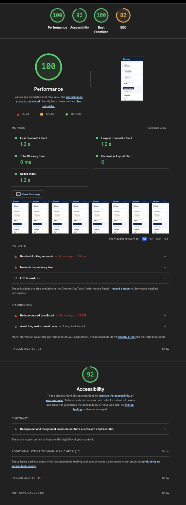

# Audit technique de `transactions-legacy.js`

## Diagnostic général

`processTransactions` est le point d’entrée fonctionnel du module et concentre le traitement principal.  
Le flux suit une séquence fixe : défauts d’options, filtrage par période, validation, conversion, catégorisation, calculs, tri et retour.  
Le code produit une structure de sortie normalisée avec totaux, compteurs, alertes et indicateurs par transaction.  
La logique métier est directement codée dans la fonction, sans abstraction intermédiaire.  
Plusieurs règles sont dépendantes de valeurs en dur : devises, seuil, mots-clés de catégorisation.  
Le module est exploitable, mais la concentration des responsabilités augmente le coût de maintenance et de test.

## Risques identifiés

- **Zone : `processTransactions` — options d’entrée**  
  **Problème observé :** `opts` est muté in-place pour injecter les valeurs par défaut.  
  **Impact potentiel :** effet de bord sur l’objet appelant et tests moins isolés.

- **Zone : `processTransactions` — filtre de période**  
  **Problème observé :** comparaison directe avec `getMonth()` en base 0, sans normalisation de l’entrée.  
  **Impact potentiel :** décalage de période si le mois fourni est au format 1–12.

- **Zone : `processTransactions` — conversion de devise**  
  **Problème observé :** taux codés en dur dans une chaîne de conditions.  
  **Impact potentiel :** maintenance manuelle et couverture incomplète des paires de devises.

- **Zone : `processTransactions` — catégorisation**  
  **Problème observé :** classification basée sur des sous-chaînes de `label`.  
  **Impact potentiel :** catégorisation approximative et sensible aux variations linguistiques.

- **Zone : `processTransactions` — seuil et alerte**  
  **Problème observé :** la condition `converted > threshold && tx.type === 'debit'` est évaluée deux fois.  
  **Impact potentiel :** duplication de règle et risque de divergence future.

- **Zone : `processTransactions` — tri final**  
  **Problème observé :** tri reconstruit à partir de chaînes formatées au lieu d’utiliser une valeur date native.  
  **Impact potentiel :** surcoût inutile et dépendance au format de sortie.

- **Zone : `legacyHelper`**  
  **Problème observé :** fonction exportée mais non utilisée par le flux principal.  
  **Impact potentiel :** code mort, bruit de maintenance et surface d’API inutile.

## Code smells identifiés

### Long Method

Localisation : `src/transactions-legacy.js`:33-230
Constat : la fonction `processTransactions` couvre l'intégralité du traitement (filtrage, validation, conversion, catégorisation, calculs, construction d'objet, tri, calculs statistiques) et fait ~197 lignes.  
Impact : difficile à lire, tester et maintenir ; rend les responsabilités floues et augmente le risque d'effets de bord lors des modifications.  
Proposition : découper `processTransactions` en fonctions plus petites (validation, conversion, catégorisation, agrégation, formatage) et extraire une couche dédiée aux règles métier.  
Priorité : Haute

### Magic Number

Localisation : `src/transactions-legacy.js`:64-66, 114-124
Constat : valeurs numériques codées en dur (seuil par défaut `1000`, taux de change `0.92`, `1.08`, `1.17`, `0.85`, fallback `1`).  
Impact : compréhension réduite — on ne sait pas la provenance/raison des valeurs — et maintenance coûteuse (mise à jour manuelle des taux). Risque d'erreurs si les unités/monnaies changent.  
Proposition : extraire ces constantes dans un module de configuration (ou charger depuis un service/externe) et documenter les unités ; utiliser des noms explicites (e.g. DEFAULT_THRESHOLD, EXCHANGE_RATES).  
Priorité : Haute

### Duplicate Code

Localisation : `src/transactions-legacy.js`:15-22 et 24-30 (formatage date), 163-167 et 193 (condition de seuil)
Constat : deux implémentations de formatage de date (une active `fmt`, une commentée `formatDate2`) et la même condition `converted > threshold && tx.type === 'debit'` évaluée à deux endroits (alerte et flag).  
Impact : duplication augmente la probabilité d'incohérences lors d'un changement (bug si l'un est modifié et pas l'autre).  
Proposition : conserver une seule fonction utilitaire de formatage et réutiliser son résultat ; extraire la logique d'alerte/flag dans une fonction commune pour garantir l'unicité de la règle.  
Priorité : Moyenne

### God Object / Module à responsabilités multiples

Localisation : `src/transactions-legacy.js`:1-239 (module entier), principal `processTransactions` 33-230
Constat : le module gère la validation, la transformation, les règles de catégorisation, le calcul des totaux, le tri et la présentation.  
Impact : faible cohésion, tests difficiles à isoler, changements localisés risquent d'impacter d'autres fonctionnalités non liées.  
Proposition : introduire des modules ou services responsables d'une seule tâche (p.ex. validator, currencyConverter, categorizer, aggregator) et orchestrer via une couche légère.  
Priorité : Haute

### Dead Code

Localisation : `src/transactions-legacy.js`:232-238 (fonction `legacyHelper`), lignes 24-30 (fonction de format commentée)
Constat : la fonction `legacyHelper` est exportée mais n'est jamais utilisée par le flux principal ; une version alternative de formatDate est commentée.  
Impact : augmente la surface de maintenance, la confusion pour les développeurs et le poids du module.  
Proposition : supprimer le code mort ou le documenter si nécessaire ; s'assurer que les exports publics reflètent l'API réellement utilisée.  
Priorité : Moyenne

### Unclear Naming

Localisation : `src/transactions-legacy.js`:42-49, 72-79, 131-136
Constat : variables peu expressives (`i`, `j`, `tx`, `d`, `lab`) et noms de constantes génériques (`TYPES`) sans documentation sur l'usage attendu.  
Impact : lecture et compréhension ralenties, risque d'erreurs lors de la réorganisation du code (ex : `d` réutilisé pour `Date`).  
Proposition : renommer les variables pour exprimer leur rôle (`index`, `innerIndex`, `transaction`, `date`, `labelLow`), et ajouter des commentaires/docstrings pour les constantes partagées.  
Priorité : Basse

### In-place Mutation / Effet de bord sur les options

Localisation : `src/transactions-legacy.js`:51-66, 68-71
Constat : l'objet `opts` passé en paramètre est muté en place pour appliquer des valeurs par défaut (ex : `opts.currency = 'EUR'`, `opts.threshold = 1000`).  
Impact : effets de bord visibles pour l'appelant, tests moins isolés et comportement non intuitif si l'objet `opts` est réutilisé ailleurs.  
Proposition : ne pas muter l'objet d'entrée ; créer un nouvel objet avec les valeurs par défaut (p.ex. `const options = { currency: 'EUR', ...opts }`) ou utiliser une fonction immuable pour normaliser les options.  
Priorité : Moyenne

## Refactoring effectué

Zone 1 — Remplacement des magic numbers et configuration des taux
Localisation : `src/transactions-legacy.js` (début du fichier + bloc conversion)
Ce que j'ai fait : j'ai extrait les valeurs numériques en constantes nommées : `DEFAULT_THRESHOLD` et une table `EXCHANGE_RATES`, puis ajouté la fonction `getExchangeRate(from,to)` pour centraliser la logique de conversion. J'ai aussi remplacé la logique conditionnelle par un appel à cette fonction.
Pourquoi : améliore la lisibilité, documente la provenance des valeurs et facilite la maintenance (mise à jour centralisée des taux ou branchement vers un service externe).

Zone 2 — Éviter la duplication de la condition d'alerte
Localisation : `src/transactions-legacy.js` (alerte / construction d'item)
Ce que j'ai fait : j'ai extrait la condition `converted > threshold && tx.type === 'debit'` dans une variable `flagged` et je l'utilise pour générer l'alerte (`warnings`) et remplir `item.flagged`.
Pourquoi : évite la duplication de la règle et diminue le risque de divergence future ; rend la logique d'alerte explicite et facile à tester.

Tests ajoutés
J'ai ajouté des tests de caractérisation dans `tests/unit/transactions-legacy.test.js` couvrant :

- conversion USD→EUR, EUR→USD, GBP→EUR et fallback pour devise inconnue ;
- comportement par défaut (seuil et flagging) ;
- filtrage par mois/année.
  Ces tests garantissent que les refactorings n'altèrent pas le comportement observable.

## Éco-Impact

L'application est déjà légère côté front : elle repose sur un bundle Vite et n'embarque pas de dépendances lourdes côté runtime.
À ce stade, l'effort prioritaire reste la qualité du code et la maintenabilité plutôt qu'une optimisation d'empreinte supplémentaire.

